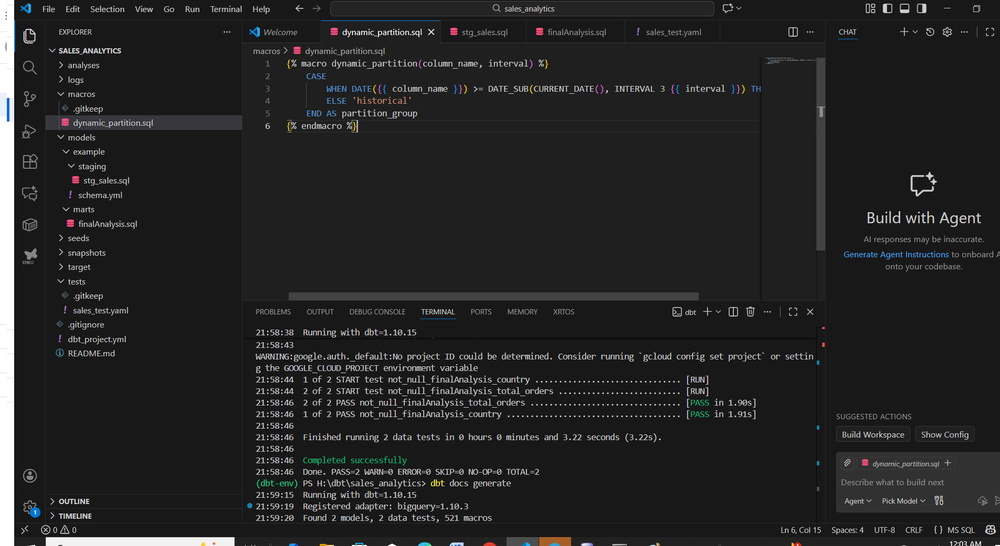
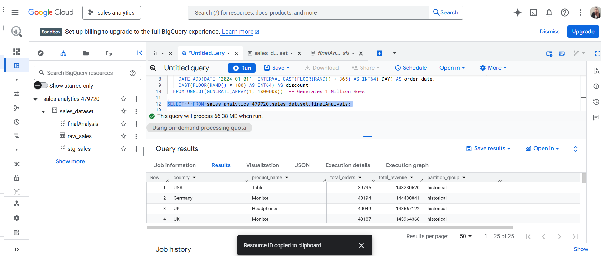
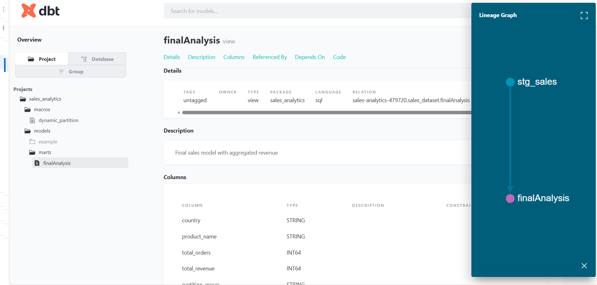

# End-to-End ELT Pipeline using dbt and BigQuery

This project is a **hands-on learning and practice project** demonstrating a complete **End-to-End ELT pipeline** using:

* **BigQuery** (Data Warehouse for raw and final analytics)
* **dbt** (Transformations, dynamic partitions & modeling)

The goal is to **practice realistic ELT workflows** and showcase data engineering skills in a learning environment.

---

## 🚀 Project Overview

The pipeline follows a clean ELT structure:

1. **Extract & Load**: Raw synthetic data generated and loaded into BigQuery staging tables.
2. **Transform**: dbt applies business logic:

   * Dynamic partitioning
   * Incremental models
   * Staging → Intermediate → Marts
3. **Analyze & Validate**: Data is queried in BigQuery to confirm successful load and transformations.
4. **Document**: dbt generates project documentation for lineage, model descriptions, and test coverage.

---

## 📦 dbt Project

Your dbt project includes:

* `models/`
* `tests/`
* `snapshots/`
* `macros/`
* Dynamic partition models

### Screenshots

**Dynamic Partition Setup in dbt:**

**Final Fact/Mart Results in BigQuery:**

**dbt Documentation (Lineage & Models):**

---

This project is ideal for **Portfolio showcase** demonstrating:

* dbt proficiency (models, partitions, transformations)
* ELT workflow understanding
* Data validation on BigQuery
* Hands-on experience with cloud data platforms
* Learning and practicing end-to-end ELT processes
